# User flows

Every path through FPR, with its edge cases. Each flow links to its stories in `user-stories.md` and its screens in the wireframes (`design/wireframes.html`, kept outside git).

In the diagrams, a rounded box is where a flow starts or ends, a rectangle is a screen or a step, a diamond is a check, and a red box is a refusal or an error.

## Access link, password user

Stories: ACC-1. The person opens the link the admin sent them.

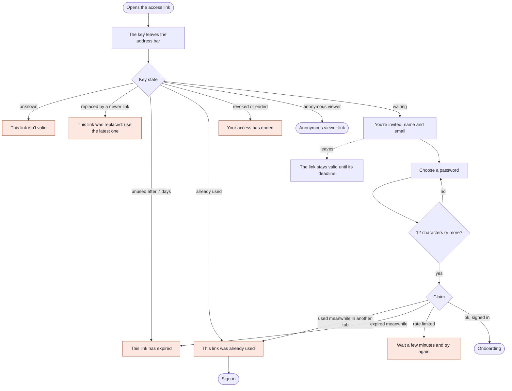
```mermaid
flowchart TD
  A(["Opens the access link"]) --> B["The key leaves the address bar"]
  B --> C{"Key state"}
  C -->|"unknown"| X1["This link isn't valid"]:::err
  C -->|"replaced by a newer link"| X5["This link was replaced: use the latest one"]:::err
  C -->|"unused after 7 days"| X2["This link has expired"]:::err
  C -->|"already used"| X3["This link was already used"]:::err
  X3 --> S(["Sign-in"])
  C -->|"revoked or ended"| X4["Your access has ended"]:::err
  C -->|"anonymous viewer"| AN(["Anonymous viewer link"])
  C -->|"waiting"| W1["You're invited: name and email"]
  W1 -.->|"leaves"| L["The link stays valid until its deadline"]
  W1 --> W2["Choose a password"]
  W2 --> V{"12 characters or more?"}
  V -->|"no"| W2
  V -->|"yes"| CL{"Claim"}
  CL -->|"used meanwhile in another tab"| X3
  CL -->|"expired meanwhile"| X2
  CL -->|"rate limited"| X6["Wait a few minutes and try again"]:::err
  CL -->|"ok, signed in"| O(["Onboarding"])
  classDef err fill:#fde8e1,stroke:#b84a1c,color:#1c222b
```

## Anonymous viewer link

Stories: ANO-1.

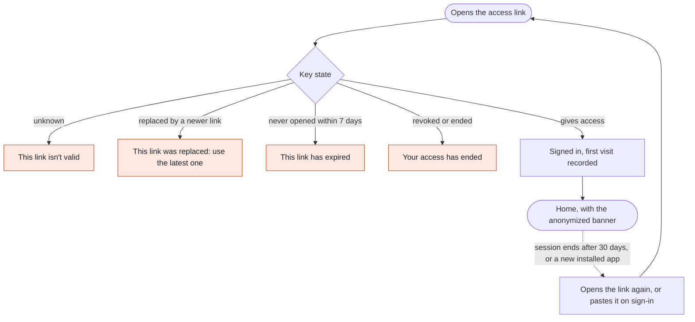
```mermaid
flowchart TD
  A(["Opens the access link"]) --> C{"Key state"}
  C -->|"unknown"| X1["This link isn't valid"]:::err
  C -->|"replaced by a newer link"| X4["This link was replaced: use the latest one"]:::err
  C -->|"never opened within 7 days"| X2["This link has expired"]:::err
  C -->|"revoked or ended"| X3["Your access has ended"]:::err
  C -->|"gives access"| S["Signed in, first visit recorded"]
  S --> H(["Home, with the anonymized banner"])
  H -.->|"session ends after 30 days, or a new installed app"| R["Opens the link again, or pastes it on sign-in"]
  R --> A
  classDef err fill:#fde8e1,stroke:#b84a1c,color:#1c222b
```

## Sign-in

Stories: ACC-2.

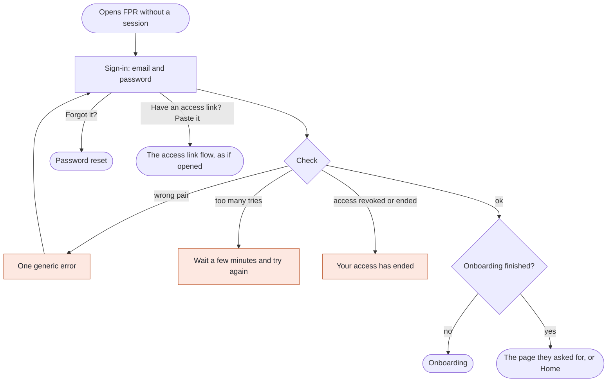
```mermaid
flowchart TD
  A(["Opens FPR without a session"]) --> F["Sign-in: email and password"]
  F --> K{"Check"}
  K -->|"wrong pair"| E1["One generic error"]:::err
  E1 --> F
  K -->|"too many tries"| E2["Wait a few minutes and try again"]:::err
  K -->|"access revoked or ended"| E3["Your access has ended"]:::err
  K -->|"ok"| OB{"Onboarding finished?"}
  OB -->|"no"| O(["Onboarding"])
  OB -->|"yes"| P(["The page they asked for, or Home"])
  F -->|"Forgot it?"| RP(["Password reset"])
  F -->|"Have an access link? Paste it"| PL(["The access link flow, as if opened"])
  classDef err fill:#fde8e1,stroke:#b84a1c,color:#1c222b
```

## Password reset

Stories: ACC-3, ADM-6. The admin gave the person a reset key.

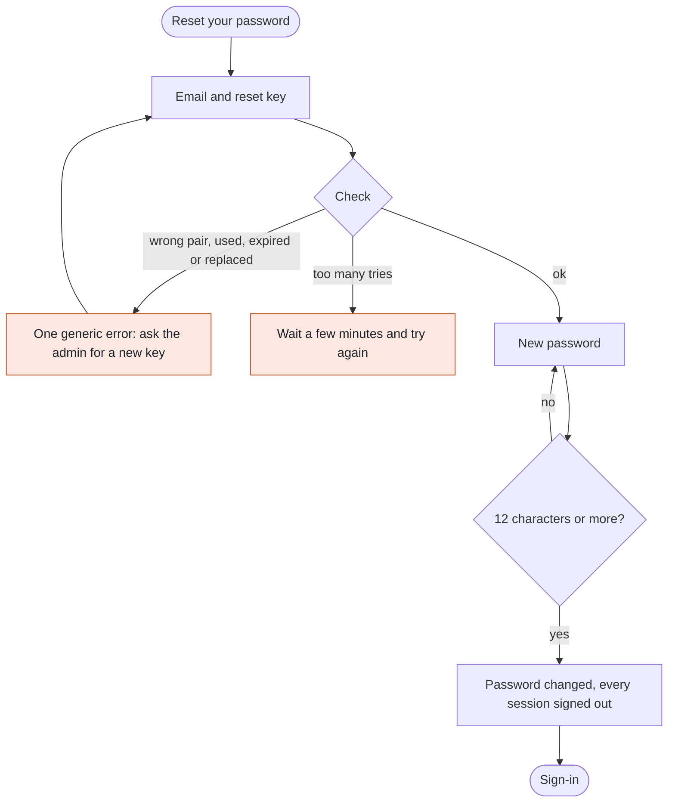
```mermaid
flowchart TD
  A(["Reset your password"]) --> F1["Email and reset key"]
  F1 --> K{"Check"}
  K -->|"wrong pair, used, expired or replaced"| E1["One generic error: ask the admin for a new key"]:::err
  E1 --> F1
  K -->|"too many tries"| E2["Wait a few minutes and try again"]:::err
  K -->|"ok"| F2["New password"]
  F2 --> V{"12 characters or more?"}
  V -->|"no"| F2
  V -->|"yes"| D["Password changed, every session signed out"]
  D --> S(["Sign-in"])
  classDef err fill:#fde8e1,stroke:#b84a1c,color:#1c222b
```

## First admin setup

Stories: first-admin case in Admin.

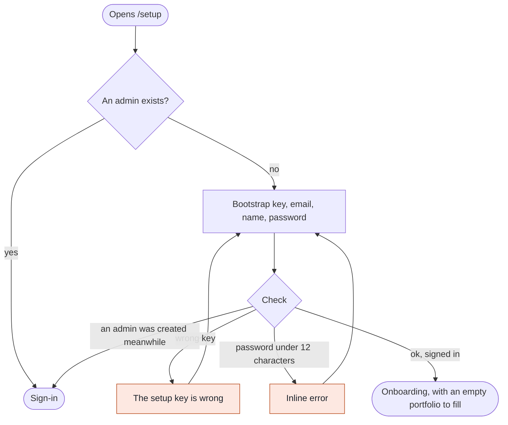
```mermaid
flowchart TD
  A(["Opens /setup"]) --> AE{"An admin exists?"}
  AE -->|"yes"| S(["Sign-in"])
  AE -->|"no"| F["Bootstrap key, email, name, password"]
  F --> K{"Check"}
  K -->|"wrong key"| E1["The setup key is wrong"]:::err
  K -->|"password under 12 characters"| E2["Inline error"]:::err
  K -->|"an admin was created meanwhile"| S
  E1 --> F
  E2 --> F
  K -->|"ok, signed in"| O(["Onboarding, with an empty portfolio to fill"])
  classDef err fill:#fde8e1,stroke:#b84a1c,color:#1c222b
```

## Onboarding

Stories: ONB-1 to ONB-4.

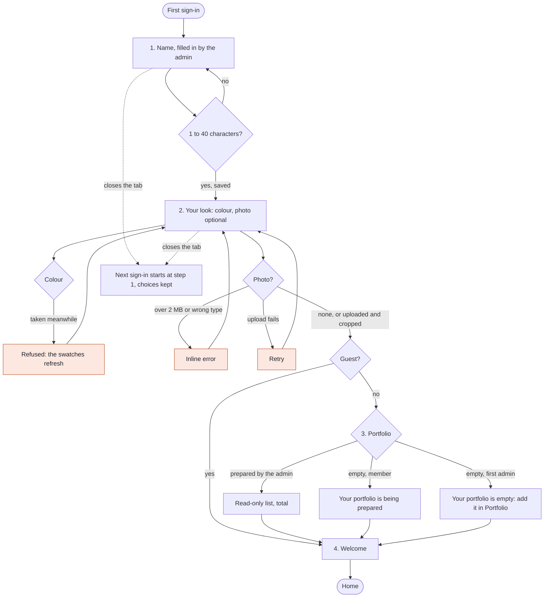
```mermaid
flowchart TD
  A(["First sign-in"]) --> N["1. Name, filled in by the admin"]
  N --> NV{"1 to 40 characters?"}
  NV -->|"no"| N
  NV -->|"yes, saved"| L["2. Your look: colour, photo optional"]
  L --> C{"Colour"}
  C -->|"taken meanwhile"| CE["Refused: the swatches refresh"]:::err
  CE --> L
  L --> PH{"Photo?"}
  PH -->|"over 2 MB or wrong type"| PE["Inline error"]:::err
  PH -->|"upload fails"| PR["Retry"]:::err
  PE --> L
  PR --> L
  PH -->|"none, or uploaded and cropped"| G{"Guest?"}
  G -->|"yes"| W["4. Welcome"]
  G -->|"no"| PF{"3. Portfolio"}
  PF -->|"prepared by the admin"| P1["Read-only list, total"]
  PF -->|"empty, member"| P2["Your portfolio is being prepared"]
  PF -->|"empty, first admin"| P3["Your portfolio is empty: add it in Portfolio"]
  P1 --> W
  P2 --> W
  P3 --> W
  W --> H(["Home"])
  N -.->|"closes the tab"| RS["Next sign-in starts at step 1, choices kept"]
  L -.->|"closes the tab"| RS
  classDef err fill:#fde8e1,stroke:#b84a1c,color:#1c222b
```

## During a visit

Stories: access cases. Any request can meet these.

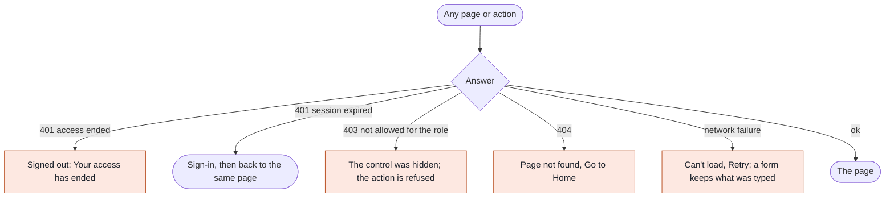
```mermaid
flowchart TD
  A(["Any page or action"]) --> R{"Answer"}
  R -->|"401 access ended"| E1["Signed out: Your access has ended"]:::err
  R -->|"401 session expired"| E2(["Sign-in, then back to the same page"])
  R -->|"403 not allowed for the role"| E3["The control was hidden; the action is refused"]:::err
  R -->|"404"| E4["Page not found, Go to Home"]:::err
  R -->|"network failure"| E5["Can't load, Retry; a form keeps what was typed"]:::err
  R -->|"ok"| OK(["The page"])
  classDef err fill:#fde8e1,stroke:#b84a1c,color:#1c222b
```

## Record a purchase or a sale

Stories: POR-2, POR-3, POR-7, ADM-7. The same flow serves a member on `/portfolio/record` and the admin on `/members/$userId/record`.

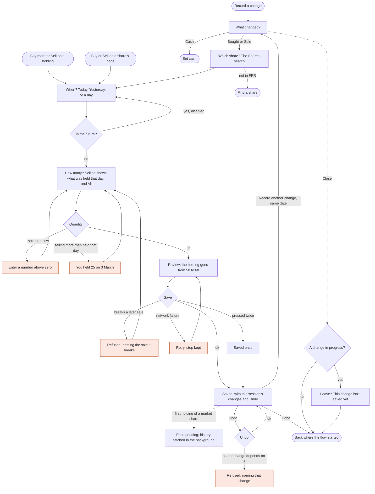
```mermaid
flowchart TD
  E1(["Record a change"]) --> W["What changed?"]
  E2(["Buy more or Sell on a holding"]) --> D
  E3(["Buy or Sell on a share's page"]) --> D
  W -->|"Cash"| CASH(["Set cash"])
  W -->|"Bought or Sold"| Q["Which share? The Shares search"]
  Q -.->|"not in FPR"| FS(["Find a share"])
  Q --> D["When? Today, Yesterday, or a day"]
  D --> DV{"In the future?"}
  DV -->|"yes, disabled"| D
  DV -->|"no"| H["How many? Selling shows what was held that day, and All"]
  H --> HV{"Quantity"}
  HV -->|"zero or below"| HE1["Enter a number above zero"]:::err
  HV -->|"selling more than held that day"| HE2["You held 25 on 3 March"]:::err
  HE1 --> H
  HE2 --> H
  HV -->|"ok"| RV["Review: the holding goes from 50 to 60"]
  RV --> SV{"Save"}
  SV -->|"breaks a later sale"| SE1["Refused, naming the sale it breaks"]:::err
  SE1 --> H
  SV -->|"network failure"| SE2["Retry, step kept"]:::err
  SE2 --> RV
  SV -->|"pressed twice"| SV1["Saved once"]
  SV -->|"ok"| OK["Saved, with this session's changes and Undo"]
  SV1 --> OK
  OK -.->|"first holding of a market share"| PP["Price pending; history fetched in the background"]
  OK -->|"Undo"| U{"Undo"}
  U -->|"a later change depends on it"| UE["Refused, naming that change"]:::err
  U -->|"ok"| OK
  OK -->|"Record another change, same date"| W
  OK -->|"Done"| BACK(["Back where the flow started"])
  W -.->|"Close"| LV{"A change in progress?"}
  LV -->|"yes"| LC["Leave? This change isn't saved yet"]
  LV -->|"no"| BACK
  LC --> BACK
  classDef err fill:#fde8e1,stroke:#b84a1c,color:#1c222b
```

## Set cash

Stories: POR-4.

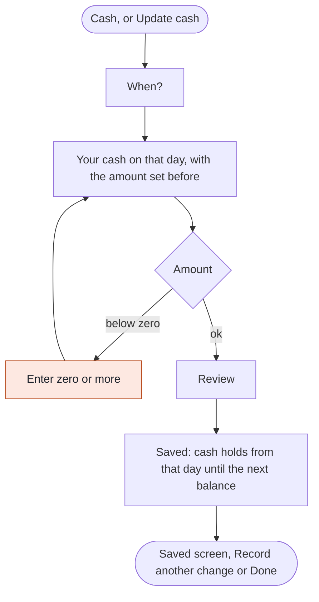
```mermaid
flowchart TD
  A(["Cash, or Update cash"]) --> D["When?"]
  D --> M["Your cash on that day, with the amount set before"]
  M --> V{"Amount"}
  V -->|"below zero"| E["Enter zero or more"]:::err
  E --> M
  V -->|"ok"| R["Review"]
  R --> S["Saved: cash holds from that day until the next balance"]
  S --> O(["Saved screen, Record another change or Done"])
  classDef err fill:#fde8e1,stroke:#b84a1c,color:#1c222b
```

## Fix the history

Stories: POR-5.

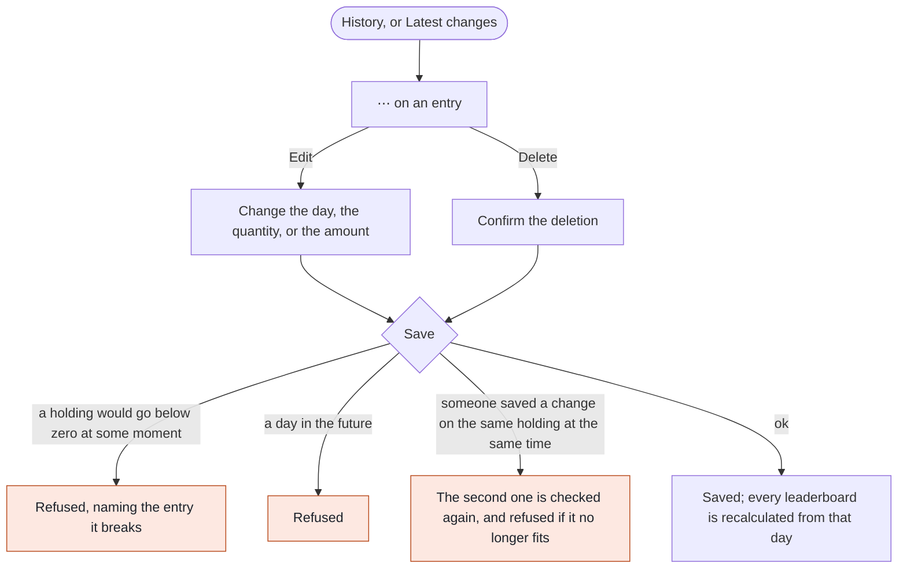
```mermaid
flowchart TD
  A(["History, or Latest changes"]) --> M["⋯ on an entry"]
  M -->|"Edit"| ED["Change the day, the quantity, or the amount"]
  M -->|"Delete"| DC["Confirm the deletion"]
  ED --> K{"Save"}
  DC --> K
  K -->|"a holding would go below zero at some moment"| E1["Refused, naming the entry it breaks"]:::err
  K -->|"a day in the future"| E2["Refused"]:::err
  K -->|"someone saved a change on the same holding at the same time"| E3["The second one is checked again, and refused if it no longer fits"]:::err
  K -->|"ok"| OK["Saved; every leaderboard is recalculated from that day"]
  classDef err fill:#fde8e1,stroke:#b84a1c,color:#1c222b
```

## Find a share

Stories: SHR-1, SHR-7. On Shares, and as the second step of recording a change.

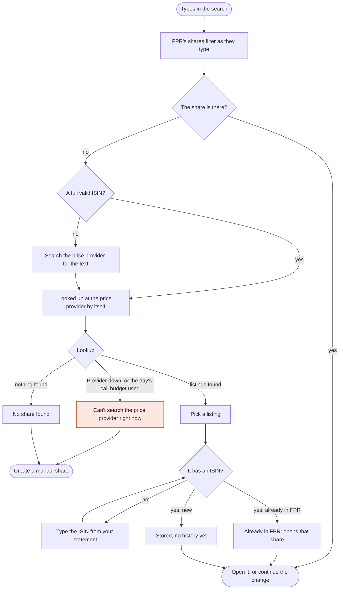
```mermaid
flowchart TD
  A(["Types in the search"]) --> F["FPR's shares filter as they type"]
  F --> FOUND{"The share is there?"}
  FOUND -->|"yes"| PICK(["Open it, or continue the change"])
  FOUND -->|"no"| ISIN{"A full valid ISIN?"}
  ISIN -->|"yes"| LK["Looked up at the price provider by itself"]
  ISIN -->|"no"| BTN["Search the price provider for the text"]
  BTN --> LK
  LK --> R{"Lookup"}
  R -->|"Provider down, or the day's call budget used"| E1["Can't search the price provider right now"]:::err
  E1 --> MAN(["Create a manual share"])
  R -->|"nothing found"| E2["No share found"]
  E2 --> MAN
  R -->|"listings found"| L["Pick a listing"]
  L --> LI{"It has an ISIN?"}
  LI -->|"no"| TI["Type the ISIN from your statement"]
  TI --> LI
  LI -->|"yes, already in FPR"| EX["Already in FPR: opens that share"]
  LI -->|"yes, new"| ST["Stored, no history yet"]
  EX --> PICK
  ST --> PICK
  classDef err fill:#fde8e1,stroke:#b84a1c,color:#1c222b
```

## Create a manual share

Stories: SHR-5. Offered only after a lookup.

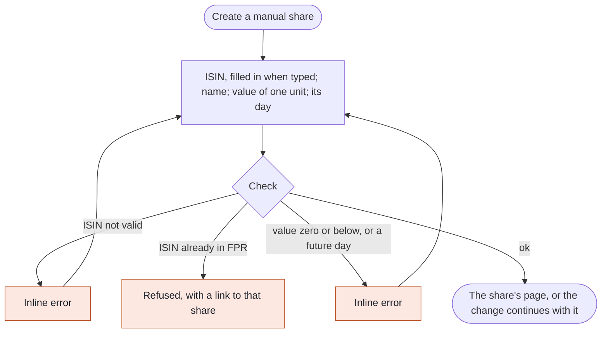
```mermaid
flowchart TD
  A(["Create a manual share"]) --> F["ISIN, filled in when typed; name; value of one unit; its day"]
  F --> K{"Check"}
  K -->|"ISIN not valid"| E1["Inline error"]:::err
  K -->|"ISIN already in FPR"| E2["Refused, with a link to that share"]:::err
  K -->|"value zero or below, or a future day"| E3["Inline error"]:::err
  E1 --> F
  E3 --> F
  K -->|"ok"| OK(["The share's page, or the change continues with it"])
  classDef err fill:#fde8e1,stroke:#b84a1c,color:#1c222b
```

## Keep a manual share's value

Stories: SHR-5, SHR-6.

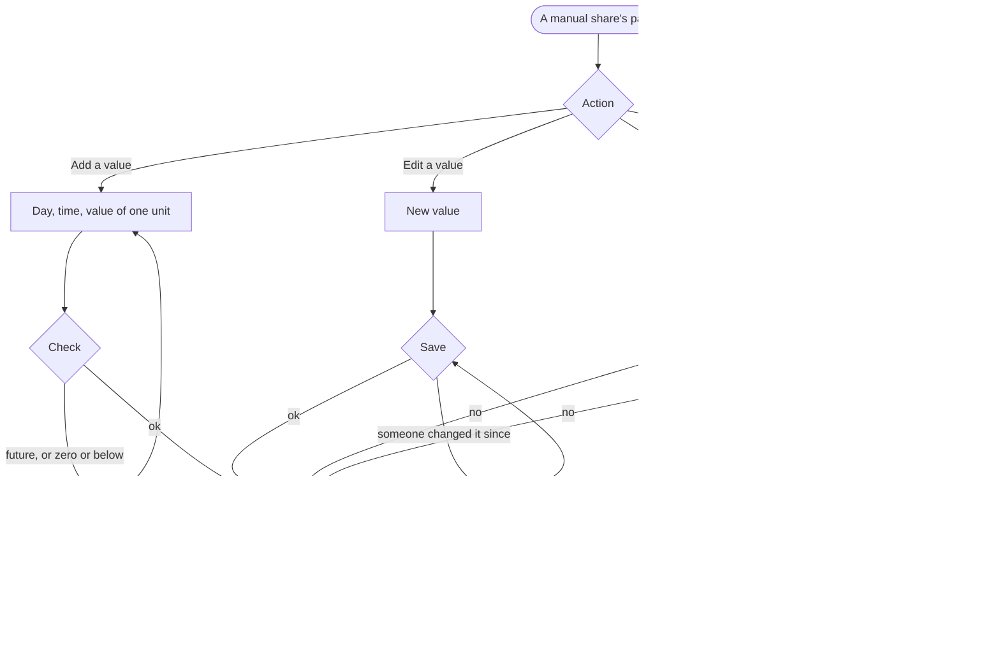
```mermaid
flowchart TD
  A(["A manual share's page"]) --> ACT{"Action"}
  ACT -->|"Add a value"| AV["Day, time, value of one unit"]
  AV --> AK{"Check"}
  AK -->|"future, or zero or below"| AE["Inline error"]:::err
  AE --> AV
  AK -->|"ok"| OK["Saved; every holder's balance updates"]
  ACT -->|"Edit a value"| EV["New value"]
  EV --> EK{"Save"}
  EK -->|"someone changed it since"| EC["Shows their value: confirm yours or cancel"]:::err
  EC --> EK
  EK -->|"ok"| OK
  ACT -->|"Delete a value"| DK{"The last one?"}
  DK -->|"yes"| DE["Delete is disabled"]:::err
  DK -->|"no"| OK
  ACT -->|"Edit name or ISIN"| NI["Dialog"]
  NI --> NK{"ISIN another share has?"}
  NK -->|"yes"| NE["Refused, with a link to that share"]:::err
  NK -->|"no"| OK
  OK -.-> LOG["Recorded: who changed which value, from what to what"]
  classDef err fill:#fde8e1,stroke:#b84a1c,color:#1c222b
```

## Follow the race on Home

Stories: LDB-1 to LDB-3, LDB-7, CMP-1 to CMP-3.

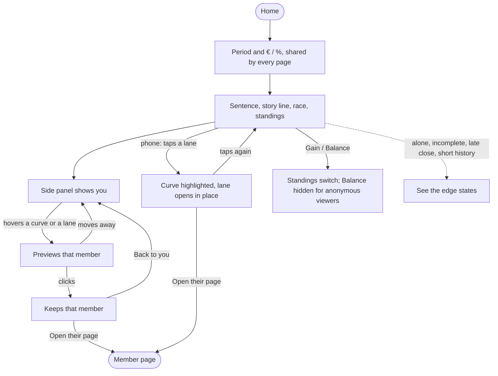
```mermaid
flowchart TD
  A(["Home"]) --> P["Period and € / %, shared by every page"]
  P --> V["Sentence, story line, race, standings"]
  V --> FD["Side panel shows you"]
  FD -->|"hovers a curve or a lane"| PV["Previews that member"]
  PV -->|"moves away"| FD
  PV -->|"clicks"| PIN["Keeps that member"]
  PIN -->|"Back to you"| FD
  PIN -->|"Open their page"| MP(["Member page"])
  V -->|"phone: taps a lane"| EX["Curve highlighted, lane opens in place"]
  EX -->|"taps again"| V
  EX -->|"Open their page"| MP
  V -->|"Gain / Balance"| SB["Standings switch; Balance hidden for anonymous viewers"]
  V -.->|"alone, incomplete, late close, short history"| ST["See the edge states"]
```

## Add a person

Stories: ADM-1, ADM-7.

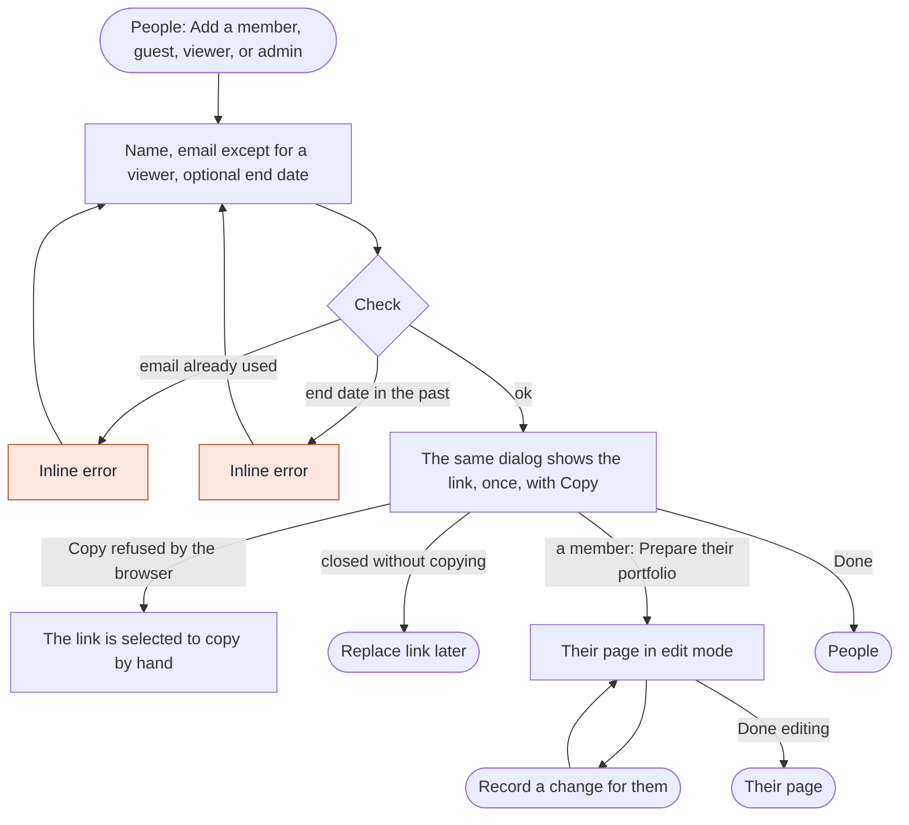
```mermaid
flowchart TD
  A(["People: Add a member, guest, viewer, or admin"]) --> F["Name, email except for a viewer, optional end date"]
  F --> K{"Check"}
  K -->|"email already used"| E1["Inline error"]:::err
  K -->|"end date in the past"| E2["Inline error"]:::err
  E1 --> F
  E2 --> F
  K -->|"ok"| LK["The same dialog shows the link, once, with Copy"]
  LK -->|"Copy refused by the browser"| SEL["The link is selected to copy by hand"]
  LK -->|"closed without copying"| RL(["Replace link later"])
  LK -->|"a member: Prepare their portfolio"| ED["Their page in edit mode"]
  ED --> RC(["Record a change for them"])
  RC --> ED
  ED -->|"Done editing"| PE(["Their page"])
  LK -->|"Done"| PP(["People"])
  classDef err fill:#fde8e1,stroke:#b84a1c,color:#1c222b
```

## Manage a person

Stories: ADM-2 to ADM-6, ADM-8.

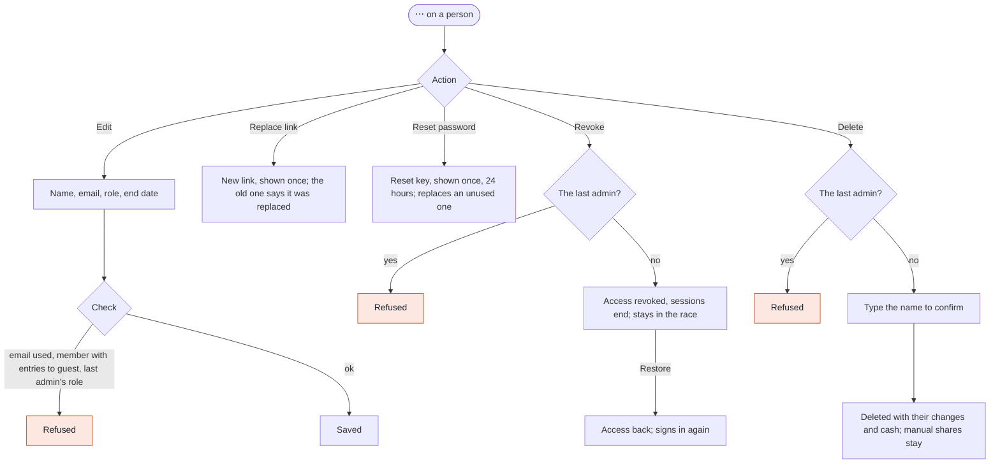
```mermaid
flowchart TD
  A(["⋯ on a person"]) --> ACT{"Action"}
  ACT -->|"Edit"| ED["Name, email, role, end date"]
  ED --> EK{"Check"}
  EK -->|"email used, member with entries to guest, last admin's role"| EE["Refused"]:::err
  EK -->|"ok"| OK["Saved"]
  ACT -->|"Replace link"| RL["New link, shown once; the old one says it was replaced"]
  ACT -->|"Reset password"| RK["Reset key, shown once, 24 hours; replaces an unused one"]
  ACT -->|"Revoke"| RV{"The last admin?"}
  RV -->|"yes"| RE["Refused"]:::err
  RV -->|"no"| RVK["Access revoked, sessions end; stays in the race"]
  RVK -->|"Restore"| RS["Access back; signs in again"]
  ACT -->|"Delete"| DL{"The last admin?"}
  DL -->|"yes"| DE["Refused"]:::err
  DL -->|"no"| DN["Type the name to confirm"]
  DN --> DD["Deleted with their changes and cash; manual shares stay"]
  classDef err fill:#fde8e1,stroke:#b84a1c,color:#1c222b
```

## Tracked shares

Stories: ADM-9 to ADM-12.

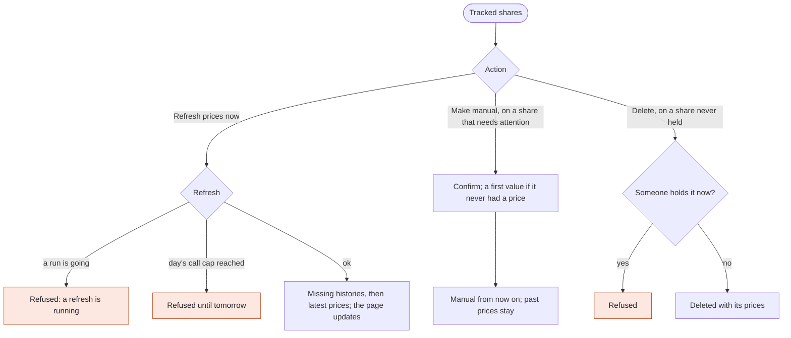
```mermaid
flowchart TD
  A(["Tracked shares"]) --> ACT{"Action"}
  ACT -->|"Refresh prices now"| RF{"Refresh"}
  RF -->|"a run is going"| RE1["Refused: a refresh is running"]:::err
  RF -->|"day's call cap reached"| RE2["Refused until tomorrow"]:::err
  RF -->|"ok"| RO["Missing histories, then latest prices; the page updates"]
  ACT -->|"Make manual, on a share that needs attention"| MM["Confirm; a first value if it never had a price"]
  MM --> MO["Manual from now on; past prices stay"]
  ACT -->|"Delete, on a share never held"| DL{"Someone holds it now?"}
  DL -->|"yes"| DE["Refused"]:::err
  DL -->|"no"| DO["Deleted with its prices"]
  classDef err fill:#fde8e1,stroke:#b84a1c,color:#1c222b
```

## A share's life

Stories: SHR-3, ADM-9 to ADM-11. What the price service does with a market share.

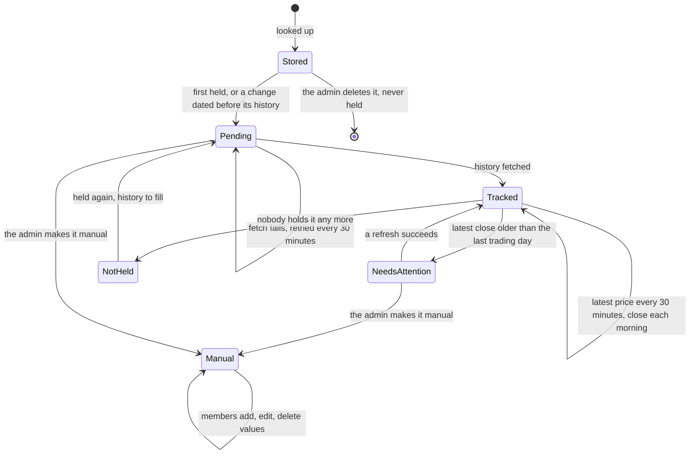
```mermaid
stateDiagram-v2
  [*] --> Stored: looked up
  Stored --> Pending: first held, or a change dated before its history
  Pending --> Tracked: history fetched
  Pending --> Pending: fetch fails, retried every 30 minutes
  Tracked --> Tracked: latest price every 30 minutes, close each morning
  Tracked --> NeedsAttention: latest close older than the last trading day
  NeedsAttention --> Tracked: a refresh succeeds
  NeedsAttention --> Manual: the admin makes it manual
  Pending --> Manual: the admin makes it manual
  Tracked --> NotHeld: nobody holds it any more
  NotHeld --> Pending: held again, history to fill
  Stored --> [*]: the admin deletes it, never held
  Manual --> Manual: members add, edit, delete values
```
